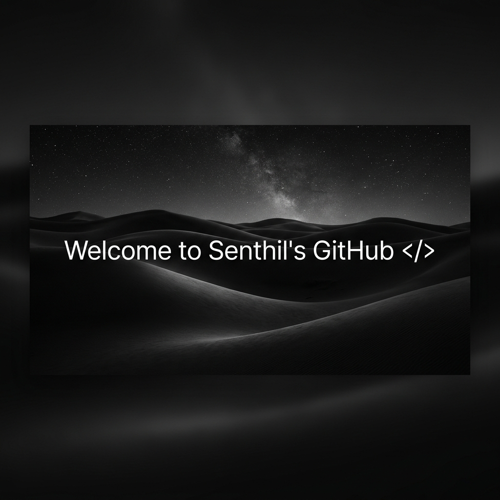
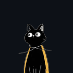

  
   
   
  

  
  &nbsp;&nbsp;&nbsp;&nbsp;
  
  &nbsp;&nbsp;&nbsp;&nbsp;
  
  

 

<h2 align="center">  <em>About  me </em></h2>

 

  Hello There! <em><b> I'm Senthil Kumar D </b></em>, a Software Engineer and Web Developer. I enjoy learning new technologies, building clean web applications, and resolving complex logic. Currently, I'm working on web development projects using Python, JavaScript, and database systems.

 

      <em><b> Software Engineering Student / Developer </b></em>  
      <em><b> Passionate about Backend & Frontend Development </b></em> 
      <em><b> Working with Python, FastAPI, JavaScript, and SQL </b></em> 
      <em><b> Tech enthusiast & Lifelong Learner </b></em> 

 
 
<h2 align="center">Tech Stack</h2>

<strong>Languages</strong>

  

<strong>Frontend</strong>

  

<strong>Backend & Database</strong>

  

 

<h2 align="center">  <em> Statistics </em> </h2>

  
  &nbsp;&nbsp;&nbsp;&nbsp;
  

 
  

